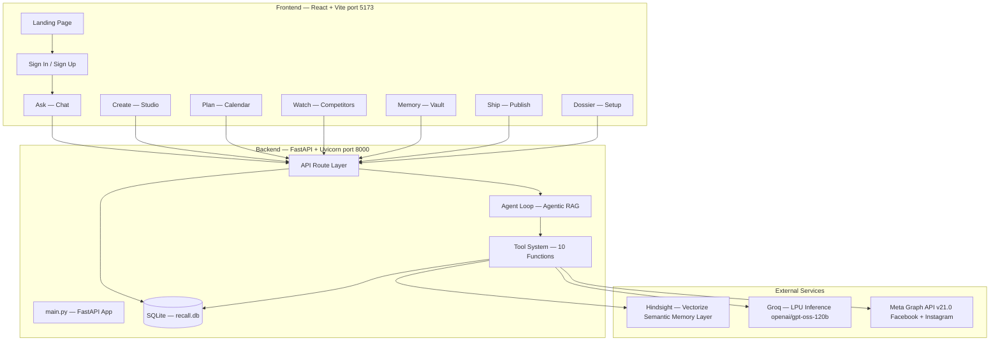
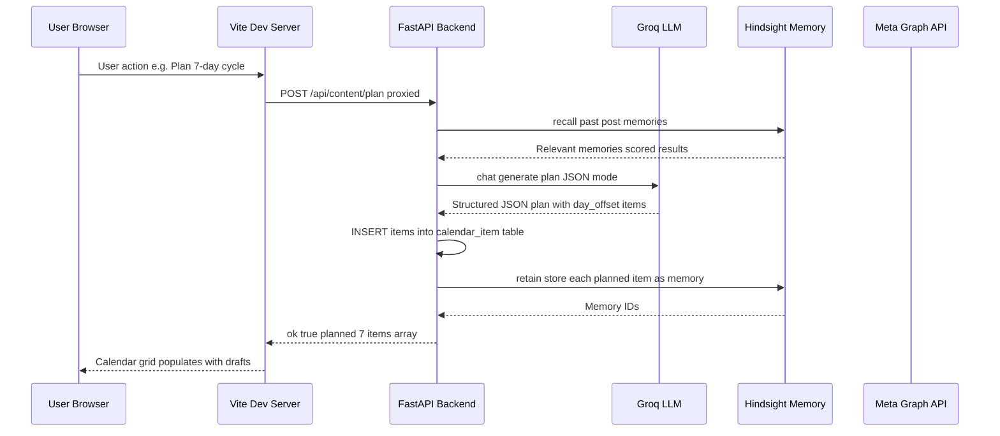
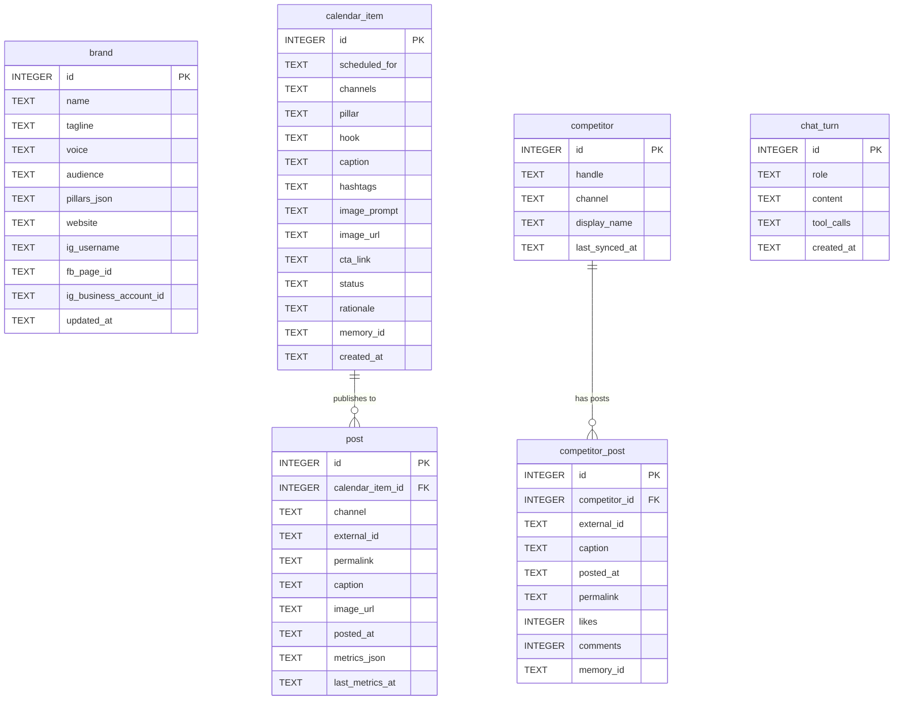
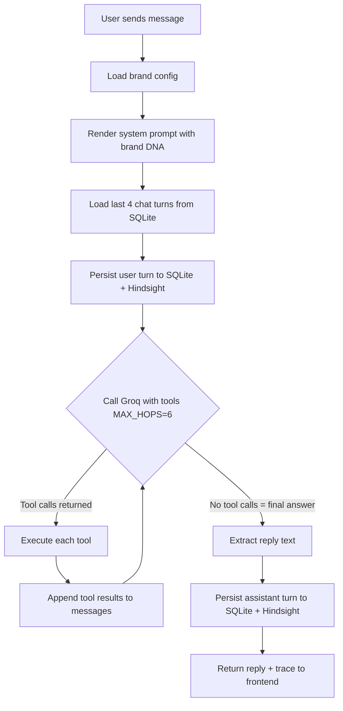
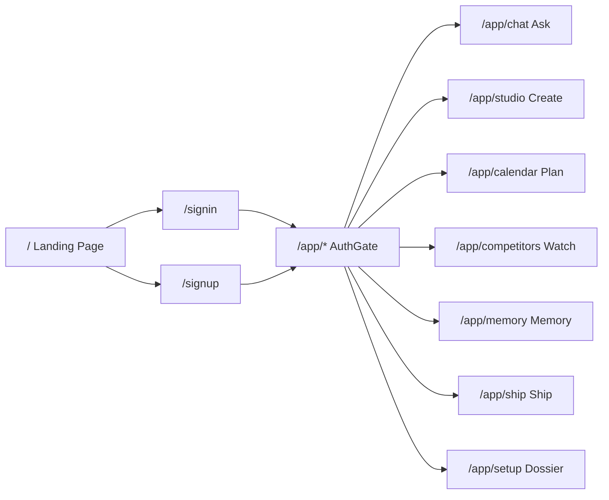
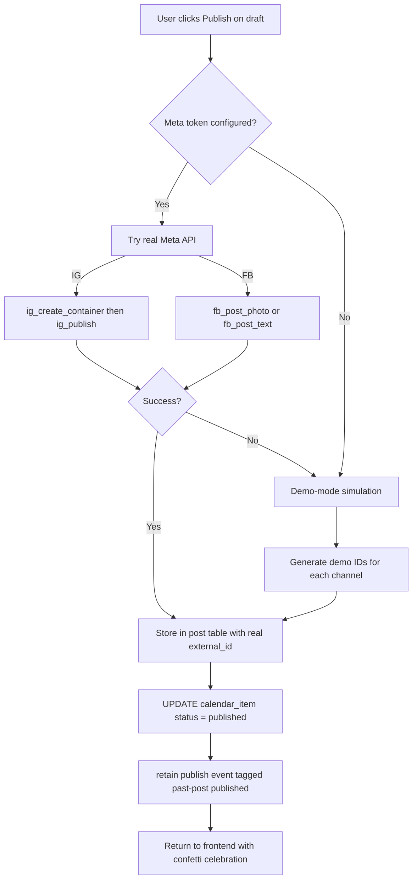
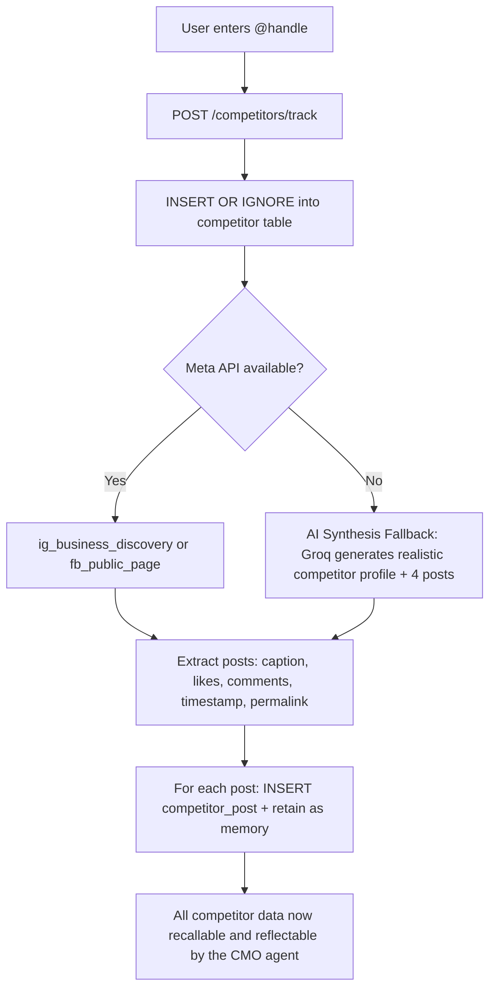
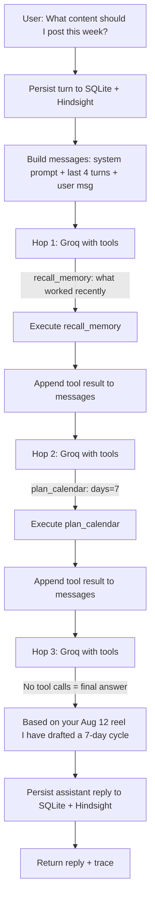

<div align="center">

# 🧠 RECALL

### A Memory-First Chief Marketing Officer — Powered by AI

**Recall** is an autonomous AI marketing agent that *remembers everything* about your brand — every post, every learning, every competitor move — and uses that growing memory to plan, create, publish, and optimize social-media content across Instagram and Facebook.

> _"The first CMO that never forgets."_

Built for the **MemHack '26** hackathon.

[](LICENSE)


</div>

---

## Table of Contents

1. [Overview and Philosophy](#overview-and-philosophy)
2. [What Makes Recall Different](#what-makes-recall-different)
3. [Feature Deep-Dive](#feature-deep-dive)
4. [System Architecture](#system-architecture)
5. [Tech Stack](#tech-stack)
6. [Database Schema](#database-schema)
7. [Backend Architecture](#backend-architecture)
   - [Entry Point and Configuration](#entry-point-and-configuration)
   - [API Route Map](#api-route-map)
   - [Agent Loop — Agentic RAG](#agent-loop--agentic-rag)
   - [Tool System](#tool-system)
   - [Hindsight Memory Client](#hindsight-memory-client)
   - [Groq LLM Client](#groq-llm-client)
   - [Meta Graph API Client](#meta-graph-api-client)
   - [Brand Seed System](#brand-seed-system)
8. [Frontend Architecture](#frontend-architecture)
   - [Routing and Auth](#routing-and-auth)
   - [Design System](#design-system)
   - [Page-by-Page Breakdown](#page-by-page-breakdown)
   - [Component Library](#component-library)
   - [API Client](#api-client)
9. [Data Flow Diagrams](#data-flow-diagrams)
   - [Memory-Grounded Content Planning](#memory-grounded-content-planning)
   - [Publishing Workflow](#publishing-workflow)
   - [Competitor Intelligence](#competitor-intelligence)
   - [Agent Chat Loop](#agent-chat-loop)
10. [Environment and Configuration](#environment-and-configuration)
11. [Getting Started](#getting-started)
12. [Project Structure](#project-structure)
13. [License](#license)

---

## Overview and Philosophy

Recall is built on a single insight:

> **Most marketing tools are amnesiac.** Every campaign starts from a blank slate. Past learnings, audience signals, competitor patterns, and brand voice nuances are lost in spreadsheets, Slack threads, and team turnover.

Recall solves this by placing a **persistent, growing memory layer** (powered by [Vectorize Hindsight](https://hindsight.vectorize.io)) at the center of every marketing decision. The AI agent:

1. **Remembers** — Every post published, every performance metric fetched, every competitor analyzed, every user instruction is retained as a semantically searchable memory.
2. **Grounds** — Before generating any content, plan, or recommendation, the agent *recalls* relevant memories and *cites* them. No cold-start hallucinations.
3. **Learns** — Post-performance metrics flow back into memory, creating a reinforcement loop: what worked gets recommended again; what underperformed gets avoided.

---

## What Makes Recall Different

| Traditional CMO Tool | Recall |
|---|---|
| Generate generic content from a prompt | Grounds every post in your specific brand memories |
| Forgets past campaigns after closing the tab | Retains every post, metric, and learning permanently |
| Manual competitor tracking via screenshots | Auto-ingests competitor posts into memory, reflects on patterns |
| One-size-fits-all recommendations | Learns YOUR brand's best days, times, pillars, and formats |
| Separate planning, creation, and publishing tools | Unified pipeline: Plan, Create, Calendar, Publish, Analyze, Learn |
| Static content pillars | Memory-aware pillar rotation that avoids repetition and leans into winners |

---

## Feature Deep-Dive

### Ask — Conversational CMO (Chat)
A chat interface where you talk to Recall like a marketing teammate. Under the hood, the agent runs an agentic loop (up to 6 tool-call hops) that can:
- **Recall memories** before answering any strategy question
- **Reflect** on accumulated knowledge to synthesize insights
- **Remember** new brand facts you share ("We're launching a new product next week")
- **Generate content plans** grounded in past post performance
- **Publish posts** directly from the conversation

Every conversation turn is persisted in both SQLite (`chat_turn` table) and Hindsight (tagged `conversation`), so the agent truly builds up context over time.

### Create — Studio (Post Generator)
A workroom with four surfaces:

| Surface | Endpoint | Description |
|---|---|---|
| **Post Generator** | `POST /studio/generate` | Enter a topic, get 3 memory-grounded post variants (A: proven winner, B: new angle, C: punchy short-form) with captions, hashtags, image prompts, CTA links, and cited memory references |
| **Signal Desk** | `GET /studio/analytics` | Aggregated metrics (reach, likes, comments, saves, engagement) across all published posts + an AI-synthesized narrative from Hindsight reflecting on what patterns are working |
| **Next Moves** | `GET /studio/recommendations` | 5 ranked, actionable recommendations grounded in brand memories, with urgency levels (now / this-week / next-week) |
| **Competitor Intel** | `GET /studio/trending` | Top competitor posts leaderboard, trending hashtags, and top theme words extracted from competitor content |

Generated variants can be saved as calendar drafts directly, with shimmer loading animations during generation.

### Plan — Editorial Calendar
A 7-day grid calendar with:
- **Drag and Drop**: Reschedule drafts by dragging between day cells with optimistic UI updates
- **Schedule Generator**: Select date range (inclusive start + end), channels, theme/focus, and CTA link to generate a memory-grounded content cycle
- **Shimmer Animations**: During generation, only cells within the selected date range show shimmering post-slot skeleton tiles
- **Presets**: Quick-select 3 days, 1 week, 2 weeks, or 1 month
- **Inline Editing**: Click any draft to view/edit caption, hashtags, image, and CTA

Three sub-tabs:
1. **Calendar Grid** — Week view with drag-and-drop
2. **Drafts Tray** — All draft items in a list with publish/delete actions, slider publish button with animated progress
3. **Published Feed** — Deduplicated published posts (Instagram + Facebook combined) with clear/delete actions and confetti celebration on publish

### Watch — Competitor Intelligence
- **Track competitors** by Instagram username or Facebook Page ID
- **Auto-sync** their recent posts via Meta Business Discovery API (with AI synthesis fallback when API is unavailable)
- **Every competitor post is retained in Hindsight** with tags like `competitor:@handle`, making them recallable and reflectable
- **Dossier view** for each competitor showing their post history, engagement metrics, and memory-stored insights
- **Untrack** competitors to remove all stored data

### Memory — The Hindsight Vault
A dedicated page to explore and manage the agent's memory:
- **Memory Constellation** — An interactive graph visualization showing interconnected memory nodes (posts, patterns, campaigns, audience insights, competitors, learnings)
- **Memory Stats** — Total nodes, facts, and observations in the Hindsight bank
- **Browse and Search** — List all memories with pagination, or semantically search with tags
- **Manual Retain** — Manually inject facts into the agent's memory
- **Reflect** — Ask synthesis questions and get answers grounded in stored memories
- **Delete** — Remove individual memories

### Ship — Quick Publish
A streamlined publishing interface for sending calendar drafts to Instagram and Facebook with a single click.

### Dossier — Brand Setup
Configure your brand identity:
- Brand name, tagline, website
- Voice guide (how the agent should write)
- Target audience description
- Content pillars (with detail for each)
- Instagram username, Facebook Page ID, IG Business Account ID
- Integration status indicators for Hindsight, Groq, and Meta
- One-click brand seed for the demo NorthPulse brand

### Landing Page
A cinematic, full-width landing page with:
- Autoplay demo video with mute/unmute toggle
- Hero section with tagline and CTA
- Animated memory constellation graph
- Feature showcase sections
- Sign-in/sign-up flows with localStorage-based sessions

---

## System Architecture



### Request Flow



---

## Tech Stack

### Backend

| Component | Technology | Purpose |
|---|---|---|
| **Web Framework** | FastAPI 0.115 | Async-capable Python REST API |
| **Server** | Uvicorn 0.30.6 | ASGI server with hot reload |
| **Database** | SQLite with WAL mode | Local persistent storage for posts, calendar, brand config, competitors, chat history |
| **LLM Engine** | Groq Cloud LPU | Ultra-fast inference for content generation, planning, recommendations |
| **LLM Model** | `openai/gpt-oss-120b` | Primary model with `openai/gpt-oss-20b` fallback |
| **Memory Layer** | Vectorize Hindsight | Semantic memory bank with retain/recall/reflect operations |
| **Social API** | Meta Graph API v21.0 | Publishing to Instagram Business + Facebook Pages, fetching competitor data via Business Discovery |
| **HTTP Client** | httpx 0.27.2 | All external API calls |
| **Config** | pydantic-settings 2.5 | Type-safe `.env` loading |

### Frontend

| Component | Technology | Purpose |
|---|---|---|
| **Framework** | React 18.3 | Component-based SPA |
| **Build Tool** | Vite 5.4 | Fast HMR dev server with API proxy |
| **Routing** | react-router-dom 6.26 | Client-side routing with auth guards |
| **Styling** | Tailwind CSS 3.4 + custom CSS design system | Warm editorial aesthetic with botanical green accents |
| **Typography** | Fraunces serif, Manrope sans, JetBrains Mono | Premium typographic hierarchy |
| **Animations** | canvas-confetti 1.9 + CSS keyframes | Celebration confetti, shimmer skeletons, micro-interactions |
| **Language** | TypeScript 5.6 | Full type safety |

---

## Database Schema

Recall uses a single SQLite database (`recall.db`) with 6 tables. Foreign keys and WAL journaling are enabled.



### Table Details

| Table | Purpose | Key Behaviors |
|---|---|---|
| `brand` | Single-row brand configuration | `CHECK (id = 1)` constraint ensures single-brand. Changing brand name clears `chat_turn` and `calendar_item` to prevent cross-contamination. |
| `calendar_item` | Content calendar entries | Status flows: `draft` to `published`. Each item can spawn multiple `post` rows (one per channel). `memory_id` links to the Hindsight memory created when the item was planned. |
| `post` | Published post records | One row per channel per calendar item. `metrics_json` stores reach, likes, comments, saves, engagement. `external_id` is the Meta platform post ID or `demo_*` for simulated publishes. |
| `competitor` | Tracked competitor accounts | Unique by `handle`. `last_synced_at` tracks when posts were last fetched. |
| `competitor_post` | Individual competitor posts | Linked to competitor and stored as Hindsight memory tagged `competitor:handle`. Engagement = likes + comments x 3. |
| `chat_turn` | Conversation history | All user/assistant turns persisted. Also retained in Hindsight tagged `conversation` for long-term memory beyond the 6-turn sliding window. |

---

## Backend Architecture

### Entry Point and Configuration

```
backend/
├── run.py                  # python run.py -> uvicorn on APP_PORT
├── requirements.txt        # FastAPI, uvicorn, httpx, pydantic, etc.
├── .env                    # API keys and configuration
├── .env.example            # Template with all supported variables
├── recall.db               # SQLite database (auto-created)
└── app/
    ├── __init__.py
    ├── main.py             # FastAPI app factory with CORS + routers
    ├── config.py           # pydantic-settings: Settings class
    ├── db.py               # SQLite connection manager + schema DDL
    ├── brand_seed.py       # Demo brand data + domain-aware seed generation
    ├── hindsight_client.py # Vectorize Hindsight HTTP client
    ├── groq_client.py      # Groq LLM client (OpenAI-compatible)
    ├── meta_client.py      # Meta Graph API client (FB + IG)
    ├── agent/
    │   ├── __init__.py
    │   ├── system_prompt.py # Agent persona + tool-use instructions
    │   ├── loop.py          # Agentic chat loop with tool calling
    │   └── tools.py         # 10 tool implementations + JSON schemas
    └── routes/
        ├── __init__.py
        ├── system.py        # GET /health, GET /status
        ├── brand.py         # GET/PUT /brand, POST /brand/seed
        ├── agent.py         # POST /agent/chat, GET/DELETE /agent/history
        ├── content.py       # CRUD for calendar items + posts + publish
        ├── competitors.py   # GET/POST/DELETE competitor tracking
        ├── memory.py        # Hindsight CRUD: retain/recall/reflect/graph
        └── studio.py        # POST /studio/generate, GET analytics/recs/trending
```

**Configuration** is managed via `pydantic-settings` loading from `.env`:

| Variable | Default | Description |
|---|---|---|
| `HINDSIGHT_BASE_URL` | `https://hindsight.vectorize.io` | Hindsight API base |
| `HINDSIGHT_API_KEY` | (required) | Bearer token for Hindsight |
| `HINDSIGHT_BANK_ID` | `northpulse` | Default memory bank, overridden by brand name |
| `GROQ_API_KEY` | (required) | Groq API key |
| `GROQ_MODEL` | `openai/gpt-oss-120b` | LLM model with auto-fallback to `openai/gpt-oss-20b` |
| `META_ACCESS_TOKEN` | (optional) | Long-lived Meta Page access token |
| `META_GRAPH_VERSION` | `v21.0` | Graph API version |
| `FB_PAGE_ID` | (optional) | Facebook Page ID |
| `IG_BUSINESS_ACCOUNT_ID` | (optional) | Instagram Business Account ID |
| `APP_PORT` | `8000` | Backend server port |
| `FRONTEND_ORIGIN` | `http://localhost:5173` | CORS allowed origin |
| `SQLITE_PATH` | `./recall.db` | Database file path |

### API Route Map

#### System Routes

| Method | Endpoint | Description |
|---|---|---|
| `GET` | `/health` | Simple health check returns `{ok: true}` |
| `GET` | `/status` | Integration status: Hindsight reachability + stats, Groq rate limits, Meta API connection status |

#### Brand Routes — `/brand`

| Method | Endpoint | Description |
|---|---|---|
| `GET` | `/brand` | Get current brand config. Auto-seeds Hindsight memories if bank is empty. |
| `PUT` | `/brand` | Update brand fields. If brand name changes: clears chat history and calendar, generates new domain-specific seed calendar drafts and Hindsight memories. |
| `POST` | `/brand/seed` | Seed the demo NorthPulse brand into SQLite + Hindsight (6 past-post memories, brand DNA, 3 demo competitors). |

#### Agent Routes — `/agent`

| Method | Endpoint | Description |
|---|---|---|
| `POST` | `/agent/chat` | Send a message, runs agentic loop with up to 6 tool-calling hops, returns final response |
| `GET` | `/agent/history` | Retrieve conversation history (last N turns) |
| `DELETE` | `/agent/history` | Wipe all conversation history |

#### Content Routes — `/content`

| Method | Endpoint | Description |
|---|---|---|
| `POST` | `/content/plan` | Generate a memory-grounded content calendar (N days, channels, focus, CTA, start date) |
| `POST` | `/content/calendar` | Create a single calendar item |
| `GET` | `/content/calendar` | List all calendar items (optionally filtered by status) |
| `PATCH` | `/content/calendar/:id` | Update a calendar item (caption, scheduled_for, status, etc.) |
| `DELETE` | `/content/calendar/:id` | Delete a calendar item (cascades to associated posts) |
| `DELETE` | `/content/calendar` | Clear all calendar items (optionally by status) |
| `POST` | `/content/calendar/:id/publish` | Publish a draft to Meta (or demo-simulate) |
| `GET` | `/content/posts` | List published posts |
| `DELETE` | `/content/posts` | Clear all published posts |
| `DELETE` | `/content/posts/:id` | Delete a single published post |
| `POST` | `/content/posts/refresh-performance` | Pull latest metrics from Meta for all posts |

#### Competitor Routes — `/competitors`

| Method | Endpoint | Description |
|---|---|---|
| `GET` | `/competitors` | List all tracked competitors with post counts |
| `POST` | `/competitors/track` | Track a new competitor: fetch posts via Meta API (or AI synthesis fallback), store in DB + Hindsight |
| `GET` | `/competitors/:handle/posts` | Get all stored posts for a specific competitor |
| `DELETE` | `/competitors/:handle` | Untrack competitor: delete all posts and competitor record |

#### Memory Routes — `/memory`

| Method | Endpoint | Description |
|---|---|---|
| `GET` | `/memory/stats` | Memory bank statistics (total nodes, facts, observations) |
| `GET` | `/memory/list` | List memories with pagination |
| `POST` | `/memory/retain` | Store a new memory |
| `POST` | `/memory/recall` | Semantic search over memories (with optional tags) |
| `POST` | `/memory/reflect` | LLM-synthesized answer grounded in all memories |
| `GET` | `/memory/graph` | Get the memory graph structure |
| `DELETE` | `/memory/:id` | Delete a specific memory |

#### Studio Routes — `/studio`

| Method | Endpoint | Description |
|---|---|---|
| `POST` | `/studio/generate` | Topic to 3 memory-grounded post variants (A: proven, B: experimental, C: punchy) |
| `GET` | `/studio/analytics` | Aggregated performance metrics + AI narrative reflecting on content patterns |
| `GET` | `/studio/recommendations` | 5 ranked, memory-grounded strategic recommendations |
| `GET` | `/studio/trending` | Top competitor posts, trending hashtags, theme word cloud, engagement leaderboard |

### Agent Loop — Agentic RAG

The chat agent (`app/agent/loop.py`) implements a multi-hop **Retrieval-Augmented Generation** loop:



**Key design decisions:**
- **Sliding window**: Only the last 4 turns are fed back to the LLM, but ALL turns are retained in Hindsight, giving the agent effectively unlimited long-term memory via `recall()`.
- **Tool forcing on last hop**: On the final (6th) hop, `tool_choice="none"` forces the LLM to produce a text answer.
- **Graceful fallback**: If `MAX_HOPS` is exhausted without a final answer, a context-aware fallback message is generated based on which tools were called.
- **Rate limit handling**: 429/rate-limit errors produce a user-friendly "temporary rate limit" message rather than crashing.

### Tool System

The agent has access to **10 tools**, each with a JSON Schema (for Groq function-calling) and a Python implementation:

| Tool | Description | Key Behavior |
|---|---|---|
| `recall_memory` | Semantic search over brand memories | Must be called before ANY strategy advice. Uses tag filters. |
| `reflect_on_memory` | LLM-synthesized answer from memories | For "what do you know about us?" type questions |
| `remember` | Store a durable fact | Categories: brand-voice, brand-audience, brand-pillar, learning, product-note, user-preference |
| `plan_calendar` | Generate N-day content cycle | Recalls past learnings, sends to Groq for JSON plan, inserts drafts, retains plan in Hindsight |
| `list_calendar` | Show current drafts/scheduled items | Direct SQLite query |
| `publish_post` | Push item to Meta or demo-simulate | Tries real Meta API, falls back to demo publish with realistic fake data |
| `list_recent_posts` | List published posts | Direct SQLite query |
| `fetch_performance` | Pull metrics from Meta | Fetches IG insights, updates metrics_json, retains performance data as memory |
| `research_competitor` | Fetch + store competitor posts | Uses IG Business Discovery, falls back to AI synthesis, stores each post as Hindsight memory |
| `list_competitors` | Show tracked competitors | With post counts |

**Dispatch mechanism**: A `_DISPATCH` dictionary maps tool names to Python functions. `run_tool(name, args)` handles argument unpacking, error catching, and returns results to the LLM.

### Hindsight Memory Client

`app/hindsight_client.py` wraps the [Vectorize Hindsight API](https://hindsight.vectorize.io):

**Memory Terminology:**
| Concept | Description |
|---|---|
| **Bank** | A memory store for one brand. Bank ID defaults to brand name slug. |
| **Items** | Free-form text retained into the bank. Hindsight extracts facts automatically. |
| **Tags** | Scoping labels: `brand-voice`, `past-post`, `learning`, `competitor:@handle`, etc. |
| **Fact Types** | `world` (durable facts), `experience` (events), `observation` (synthesized) |
| **recall()** | Semantic search — returns raw memory results with scores |
| **reflect()** | LLM-synthesized answer grounded in stored memories |

**Auto-bank creation**: If a `recall()` or `retain()` call returns 404 (bank not found), the client automatically calls `ensure_bank()` and retries.

**Dynamic bank ID**: The bank ID is derived from the current brand name in SQLite, so switching brands automatically switches memory banks.

### Groq LLM Client

`app/groq_client.py` provides an OpenAI-compatible chat completions client with:

- **Model fallback**: Primary `openai/gpt-oss-120b` to fallback `openai/gpt-oss-20b` on 413/429 errors
- **JSON validation recovery**: On Groq's `json_validate_failed` (400), retries without `response_format` constraint and increases `max_tokens`
- **Rate limit tracking**: Parses `x-ratelimit-*` headers and exposes live limits via `get_groq_limits()`
- **Robust JSON parsing** (`safe_parse_json`): Strips markdown code fences, extracts JSON from wrapper text, handles partial responses

### Meta Graph API Client

`app/meta_client.py` wraps Meta's Graph API for:

| Capability | API Call |
|---|---|
| FB text post | `POST /{page_id}/feed` |
| FB photo post | `POST /{page_id}/photos` |
| IG container create | `POST /{ig_user}/media` |
| IG publish | `POST /{ig_user}/media_publish` |
| IG recent media | `GET /{ig_user}/media` |
| IG media insights | `GET /{media_id}/insights` |
| FB page posts | `GET /{page_id}/posts` |
| IG Business Discovery | `GET /{our_ig_user}?fields=business_discovery.username(...)` |

**Demo-mode publishing**: When Meta API is unconfigured or returns errors, `publish_post()` seamlessly falls back to simulated publishing with realistic fake `external_id`s, `permalink`s, and demo metrics — so the full pipeline works end-to-end without real Meta credentials.

### Brand Seed System

`app/brand_seed.py` provides zero-config demo data:

- **NorthPulse**: A fictional D2C athletic apparel brand with 5 content pillars, 6 seed memory items, and 3 demo competitors (On Running, Tracksmith, Gymshark)
- **Domain-aware seed generation**: When the user changes the brand name, the system detects the brand category (e.g., grocery/delivery vs. general) and generates appropriate seed history and calendar drafts with realistic past-post metrics
- **Auto-calendar drafts**: On brand change, 2-4 starter draft posts are inserted into the calendar

---

## Frontend Architecture

### Routing and Auth



**Authentication**: Client-side only, using `localStorage`. The `useAuth()` hook stores a session object (`{email, name, joinedAt}`) under the key `recall.session`. The `AuthGate` component redirects unauthenticated users to `/signin`.

### Design System

The visual identity follows a **warm editorial / research archive aesthetic**:

| Token | Value | Usage |
|---|---|---|
| `--brand` | `#2F8F3A` Botanical green | Primary accent, CTAs, status indicators |
| `--brand-deep` | `#236E2B` Deep green | Text on green backgrounds |
| `--ink` | `#1C1917` Near black | Primary text |
| `--muted` | `#78716C` Warm gray | Secondary text |
| `--surface` | `#FAF9F7` Warm white | Page background |
| `--line` | `#E7E5E4` | Borders and dividers |

**Typography**:
- **Fraunces** (serif) — Page titles, card headlines, hero text
- **Manrope** (sans-serif) — Body text, navigation, buttons
- **JetBrains Mono** — Code, labels, eyebrows, metrics, dates

**Component classes**:
- `.card` — Rounded white panels with subtle shadow
- `.btn`, `.btn-primary`, `.btn-ghost`, `.btn-ink` — Button variants
- `.pill` — Small rounded badges
- `.field-label`, `.input` — Form elements
- `.shimmer-slot-tile` — Animated skeleton loading tiles for calendar
- `.appbar` — Top navigation bar with glassmorphism effect

### Page-by-Page Breakdown

| Page | File | Size | Key Features |
|---|---|---|---|
| **Landing** | `Landing.tsx` | 27 KB | Full-width hero video player, animated memory constellation, feature sections, CTA |
| **Sign In** | `Signin.tsx` | 5 KB | Email-based localStorage auth |
| **Sign Up** | `Signup.tsx` | 6 KB | Name + email registration with brand creation |
| **Chat (Ask)** | `Chat.tsx` | 23 KB | Markdown-rendered messages, tool call traces, loading indicators, history management |
| **Studio (Create)** | `Studio.tsx` | 42 KB | 4-tab workroom: generator with shimmer loading, analytics dashboard, recommendations panel, trending leaderboard |
| **Calendar (Plan)** | `Calendar.tsx` | 45 KB | 7-day grid with drag-and-drop, schedule generator with inclusive date math, shimmer tiles on selected range, publish slider button with progress, confetti celebrations, deduplication |
| **Competitors (Watch)** | `Competitors.tsx` | 21 KB | Track/untrack interface, competitor dossier cards, post lists with engagement metrics |
| **Memory** | `Memory.tsx` | 25 KB | Interactive memory constellation, stats, search/filter, manual retain, reflect query, memory list |
| **Ship** | `Ship.tsx` | 15 KB | Quick-publish dashboard for draft items |
| **Setup (Dossier)** | `Setup.tsx` | 21 KB | Brand configuration form, integration status, seed button |

### Component Library

| Component | File | Description |
|---|---|---|
| `Shell` | `Shell.tsx` | Main app shell: top navbar with logo, brand pill, navigation links, integration status indicators, user menu, command palette, footer |
| `PageHeader` | `Shell.tsx` | Standardized page header with eyebrow, title, kicker, and optional right-side actions |
| `Sparkline` | `Shell.tsx` | SVG polyline sparkline chart component |
| `ProgressRing` | `Shell.tsx` | SVG circular progress indicator |
| `CommandPalette` | `CommandPalette.tsx` | Cmd+K / Ctrl+K quick-navigation overlay |
| `DisclosurePrimitives` | `DisclosurePrimitives.tsx` | `UnderstatedTabs`, `ActionMenu`, `TechnicalDetails`, `ShowMore` — progressive disclosure UI primitives |
| `HeroVideoPlayer` | `HeroVideoPlayer.tsx` | Full-width autoplay video with mute toggle for the landing page |
| `HeroDemo` | `HeroDemo.tsx` | Interactive demo component for the landing page |
| `MemoryConstellation` | `MemoryConstellation.tsx` | SVG-based interactive graph of memory nodes with categories, connections, hover tooltips, and click details |
| `MemoryDrawer` | `MemoryDrawer.tsx` | Slide-out drawer for memory detail inspection |
| `MarkdownView` | `MarkdownView.tsx` | Custom markdown renderer for chat messages with code blocks, lists, bold, links |

### API Client

`frontend/src/lib/api.ts` provides a typed API client:

```typescript
// All requests are proxied through Vite: /api/* -> http://localhost:8000/*
const BASE = "/api";

export const api = {
  status: () => req("/status"),
  brand:  { get, put, seed },
  agent:  { chat, history, wipe },
  content: { plan, calendar, createItem, updateItem, deleteItem, 
             publish, posts, clearPosts, deletePost, clearCalendar, refreshPerf },
  competitors: { list, track, posts, untrack },
  studio: { generate, analytics, recommendations, trending },
  memory: { stats, list, recall, reflect, retain, graph },
};
```

The Vite dev server proxies `/api/*` to `http://localhost:8000/*` (stripping the `/api` prefix), configured in `vite.config.ts`.

---

## Data Flow Diagrams

### Memory-Grounded Content Planning

```mermaid
flowchart LR
    A[User selects dates + channels] --> B["POST /content/plan"]
    B --> C["recall past post performance tags: past-post, learning"]
    C --> D["Build LLM prompt with Brand DNA + Retrieved memories + Focus/theme + Day count"]
    D --> E["Groq chat JSON mode temperature 0.55"]
    E --> F["Parse JSON items array with day_offset, pillar, hook, caption, hashtags"]
    F --> G["INSERT each item into calendar_item table"]
    G --> H["retain each item as new memory tagged content-plan"]
    H --> I["Return to frontend: planned count + items"]
```



### Publishing Workflow



### Competitor Intelligence



### Agent Chat Loop



---

## Environment and Configuration

### Required API Keys

| Service | Variable | How to Get |
|---|---|---|
| **Hindsight** | `HINDSIGHT_API_KEY` | [ui.hindsight.vectorize.io](https://ui.hindsight.vectorize.io) — Promo code `MEMHACK99` for $50 credit |
| **Groq** | `GROQ_API_KEY` | [console.groq.com/keys](https://console.groq.com/keys) |
| **Meta** (optional) | `META_ACCESS_TOKEN` | [developers.facebook.com](https://developers.facebook.com) — Requires: `pages_read_engagement`, `pages_manage_posts`, `instagram_basic`, `instagram_content_publish`, `instagram_manage_insights` |

### .env File Template

```env
# === Hindsight (memory) ===
HINDSIGHT_BASE_URL=https://hindsight.vectorize.io
HINDSIGHT_API_KEY=your_key_here
HINDSIGHT_BANK_ID=northpulse

# === Groq (LLM) ===
GROQ_API_KEY=your_key_here
GROQ_MODEL=openai/gpt-oss-120b

# === Meta Graph API (optional — demo mode works without) ===
META_ACCESS_TOKEN=
META_GRAPH_VERSION=v21.0
FB_PAGE_ID=
IG_BUSINESS_ACCOUNT_ID=

# === App ===
APP_ENV=dev
APP_PORT=8000
FRONTEND_ORIGIN=http://localhost:5173
SQLITE_PATH=./recall.db
```

---

## Getting Started

### Prerequisites

- **Python 3.11+** with `pip`
- **Node.js 18+** with `npm`
- API keys for Hindsight and Groq (see above)

### 1. Clone and Configure

```bash
git clone https://github.com/your-org/recall.git
cd recall

# Backend environment
cp backend/.env.example backend/.env
# Edit backend/.env with your API keys
```

### 2. Backend Setup

```bash
cd backend

# Create virtual environment
python -m venv .venv

# Activate (Windows)
.venv\Scripts\activate

# Activate (macOS/Linux)
source .venv/bin/activate

# Install dependencies
pip install -r requirements.txt

# Start the server
python run.py
# Server running on http://localhost:8000
```

### 3. Frontend Setup

```bash
cd frontend

# Install dependencies
npm install

# Start dev server
npm run dev
# App running on http://localhost:5173
```

### 4. First-Time Setup

1. Open `http://localhost:5173` in your browser
2. Click **"Enter the Desk"** on the landing page
3. Create an account (email + name — stored locally)
4. Navigate to **Dossier** (Setup) to configure your brand, or click **"Seed NorthPulse"** for the demo brand
5. Start chatting in **Ask**, creating content in **Create**, or planning in **Plan**

### 5. Production Build

```bash
cd frontend
npm run build
# Output in frontend/dist/
```

---

## Project Structure

```
recall-main/
├── LICENSE                          # MIT License
├── README.md                        # This file
├── CREDENTIALS.md                   # API key setup guide
├── HANDOFF.md                       # Developer handoff document
│
├── backend/
│   ├── .env                         # Environment variables (gitignored)
│   ├── .env.example                 # Template for .env
│   ├── requirements.txt             # Python dependencies
│   ├── run.py                       # Entry point: uvicorn launcher
│   ├── recall.db                    # SQLite database
│   └── app/
│       ├── __init__.py
│       ├── main.py                  # FastAPI app with CORS + all routers
│       ├── config.py                # Pydantic settings from .env
│       ├── db.py                    # SQLite schema + connection manager
│       ├── brand_seed.py            # Demo data + domain-aware seeding
│       ├── hindsight_client.py      # Vectorize Hindsight memory client
│       ├── groq_client.py           # Groq LLM client with fallback
│       ├── meta_client.py           # Meta Graph API client (FB + IG)
│       ├── agent/
│       │   ├── system_prompt.py     # CMO persona + tool instructions
│       │   ├── loop.py              # Multi-hop agentic chat loop
│       │   └── tools.py             # 10 tools: recall, reflect, remember,
│       │                            #   plan, publish, performance, competitor
│       └── routes/
│           ├── system.py            # /health, /status
│           ├── brand.py             # Brand CRUD + Hindsight seeding
│           ├── agent.py             # /agent/chat, /agent/history
│           ├── content.py           # Calendar + post CRUD + publish
│           ├── competitors.py       # Competitor tracking CRUD
│           ├── memory.py            # Hindsight CRUD endpoints
│           └── studio.py            # Generate, analytics, recs, trending
│
└── frontend/
    ├── index.html                   # HTML entry point
    ├── package.json                 # npm dependencies
    ├── vite.config.ts               # Vite + API proxy config
    ├── tailwind.config.js           # Tailwind + design tokens
    ├── tsconfig.json                # TypeScript config
    └── src/
        ├── main.tsx                 # React DOM render
        ├── App.tsx                  # Router + auth gate
        ├── index.css                # Full design system + Tailwind
        ├── Recall_Logo.png          # Brand logo asset
        ├── Demo_Video.mp4           # Landing page demo video
        ├── lib/
        │   ├── api.ts               # Typed API client (all endpoints)
        │   ├── auth.ts              # localStorage auth hook
        │   └── icons.tsx            # SVG icon components
        ├── components/
        │   ├── Shell.tsx            # App shell: navbar, footer, helpers
        │   ├── CommandPalette.tsx    # Cmd+K quick navigation
        │   ├── DisclosurePrimitives.tsx # Tabs, menus, expand/collapse
        │   ├── HeroVideoPlayer.tsx  # Landing page video player
        │   ├── HeroDemo.tsx         # Landing page interactive demo
        │   ├── MemoryConstellation.tsx # Interactive memory graph
        │   ├── MemoryDrawer.tsx     # Memory detail slide-out
        │   └── MarkdownView.tsx     # Chat message renderer
        └── pages/
            ├── Landing.tsx          # Public landing page
            ├── Signin.tsx           # Sign in
            ├── Signup.tsx           # Sign up
            ├── Chat.tsx             # Ask — conversational CMO
            ├── Studio.tsx           # Create — post generator + analytics
            ├── Calendar.tsx         # Plan — editorial calendar
            ├── Competitors.tsx      # Watch — competitor intel
            ├── Memory.tsx           # Memory — Hindsight vault
            ├── Ship.tsx             # Ship — quick publish
            └── Setup.tsx            # Dossier — brand config
```

---

## License

MIT License. See [LICENSE](LICENSE) for details.

---

<div align="center">

**Built with memory at MemHack '26**

*Hindsight x Groq x Meta Graph API*

</div>
